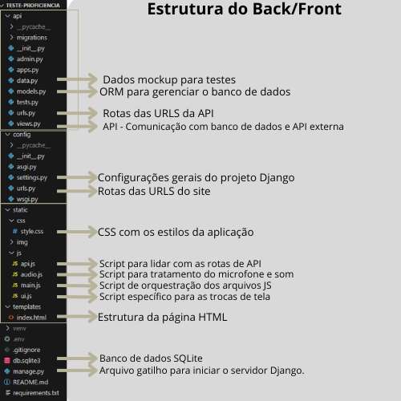

# PI 2 UNIVESP - Quiz para detectar o nível de proficiencia Português-Inglês

## Objetivo
Desenvolver uma aplicação web com integração de inteligência artificial para identificar o nível de proficiência em português de falantes estrangeiros, especialmente nativos da língua inglesa.

----------------------------------------------------------

### Como instalar:

- O Python deve estar instalado em sua máquina. Na instalação do Python no Windows, marque a caixa *Add python.exe to PATH*.

1 - Baixe ou clone o repositório git.

2 - Acesse a pasta *teste-proficiencia*.

3 - Dentro da pasta, abra o prompt de comando e crie o ambiente virtual *venv* (Virtual Environment):
```bash
py -m venv venv
```

4 - Ative o venv:
```bash
venv/Scripts/activate
```

5 - Instale as bibliotecas (requirements.txt)
```bash
pip install -r requirements.txt
```

6 - Inicie o servidor Flask:
```bash
py manage.py runserver
```

----------------------------------------------------------

### Banco de dados:

1 - Crie o database MySQL utilizando o arquivo "pi_proficiencia.sql".

2 - Crie um arquivo nomeado ".env" para armazenar as seguintes variáveis de ambiente:
```bash 
DB_NAME=pi_proficiencia
DB_USER=seuUsername
DB_PASSWORD=suaSenha
DB_HOST=hostDaSuaMaquina
DB_PORT=portaParaConexao
```

----------------------------------------------------------

### Backend

- Python
- Django
- Javascript
- MySQL

#### Frontend

- HTML/CSS
- Javascript

# Estrutura do projeto explicada




